# eCommerce App UI - Flutter

This is a Flutter-based eCommerce app UI that provides a visually appealing and user-friendly shopping experience. The project includes various screens showcasing different aspects of an eCommerce application, such as product listings, product details, cart, checkout, and more.

## Features

- Modern eCommerce UI design
- Responsive layout for different screen sizes
- Product listing and details pages
- Shopping cart and checkout screens
- User-friendly navigation

## Screenshots

Here are some screenshots of the app:
<p align="center">
   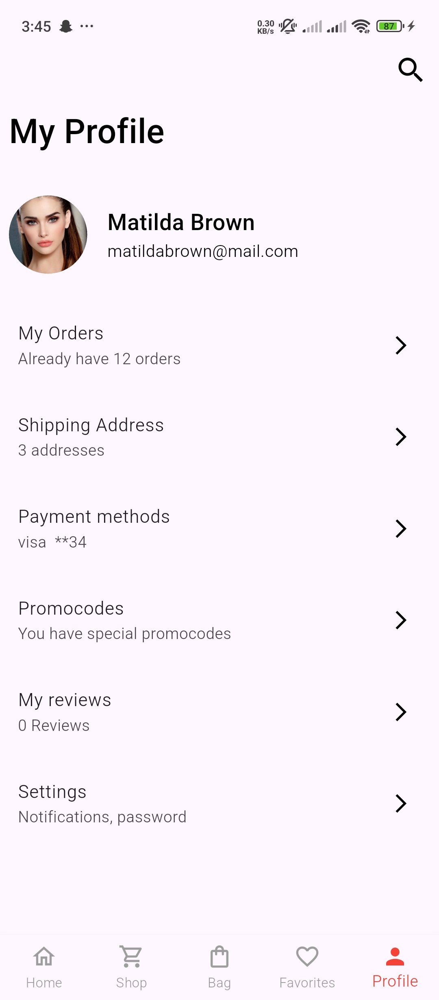
   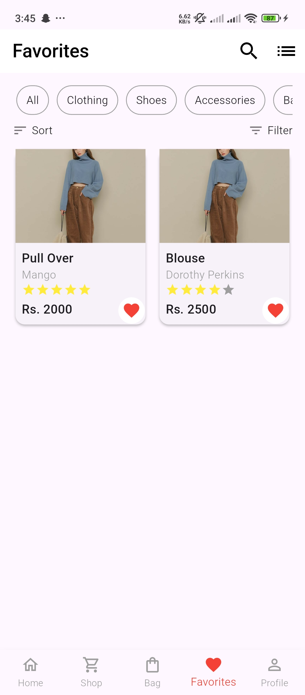
   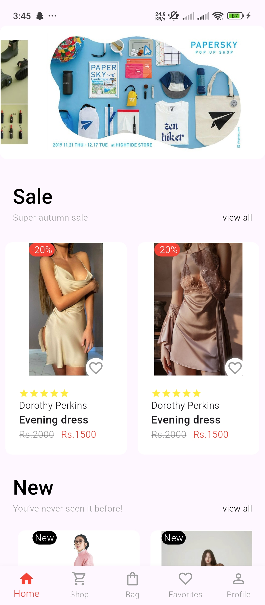
   
</p>
<p align="center">
   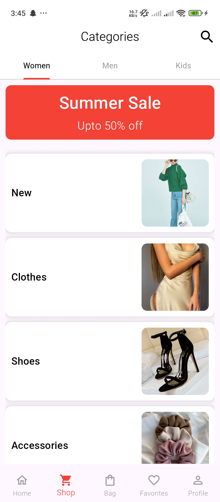
   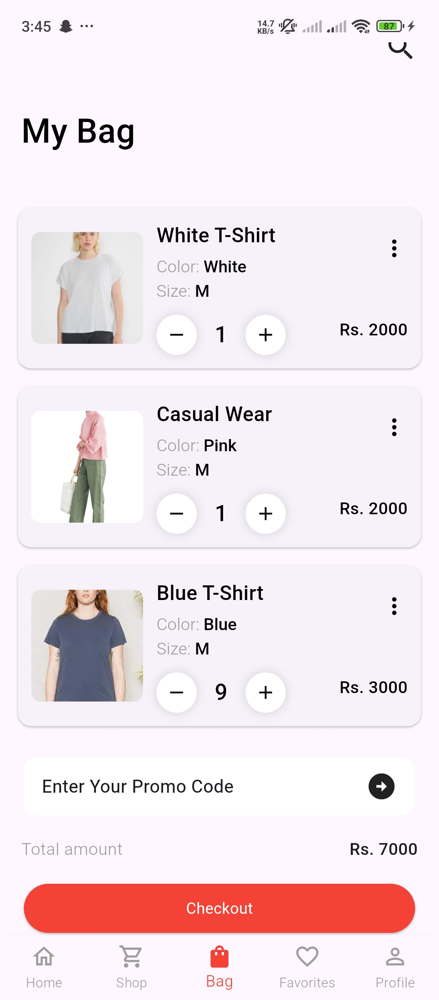
   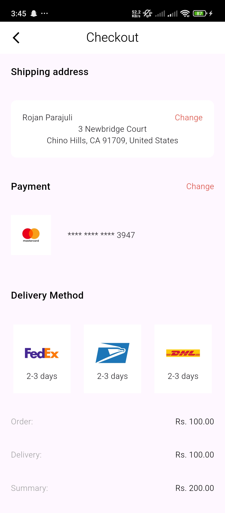
   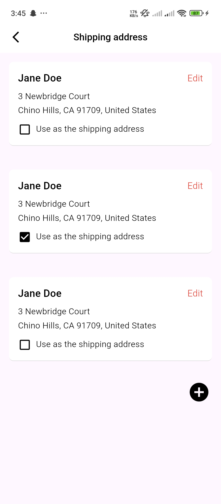
</p>
<p align="center">
   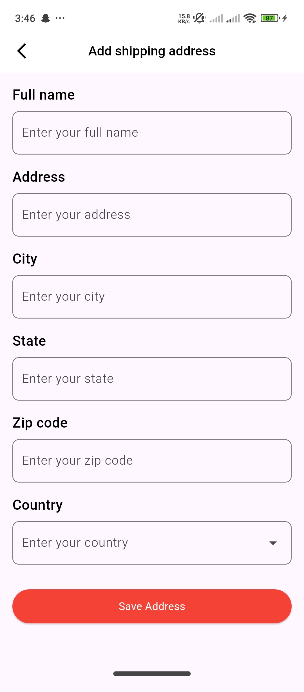
   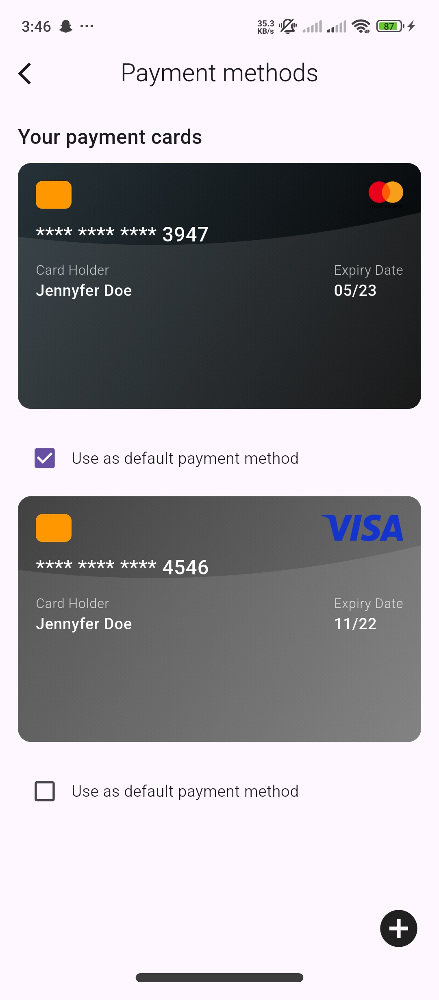
   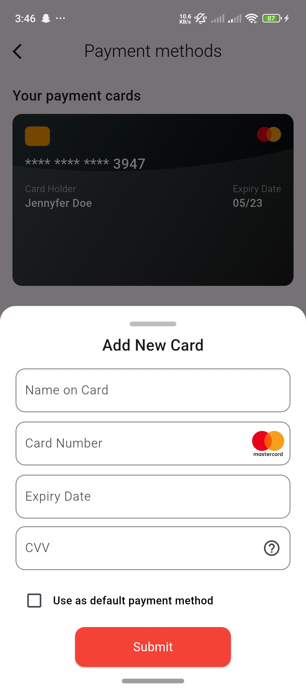
   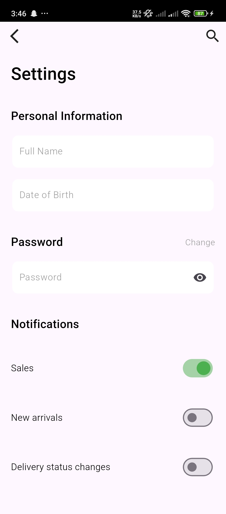
</p>
<p align="center">
   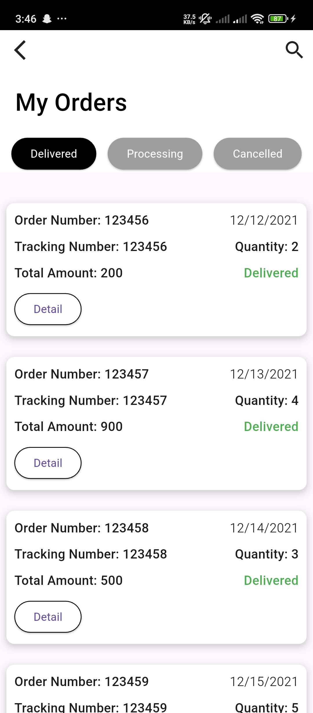
   
   
</p>

## Getting Started

To run this project locally, follow these steps:

### Prerequisites
- Install [Flutter](https://flutter.dev/docs/get-started/install)
- Ensure you have a device or emulator set up

### Installation
1. Clone this repository:
   ```sh
   git clone https://github.com/rojanparajuli/ecommerce_app.git
   cd ecommerce-app-ui
   ```
2. Install dependencies:
   ```sh
   flutter pub get
   ```
3. Run the app:
   ```sh
   flutter run
   ```

## Contribution
If you'd like to contribute to this project, feel free to fork the repository and submit a pull request.

## License
This project is open-source.

---

For more information, check the official [Flutter documentation](https://flutter.dev/docs).
